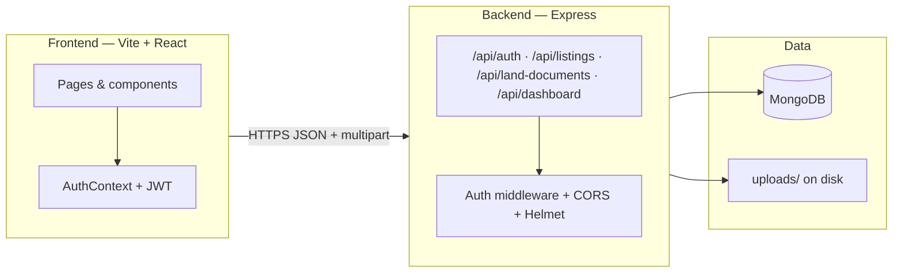
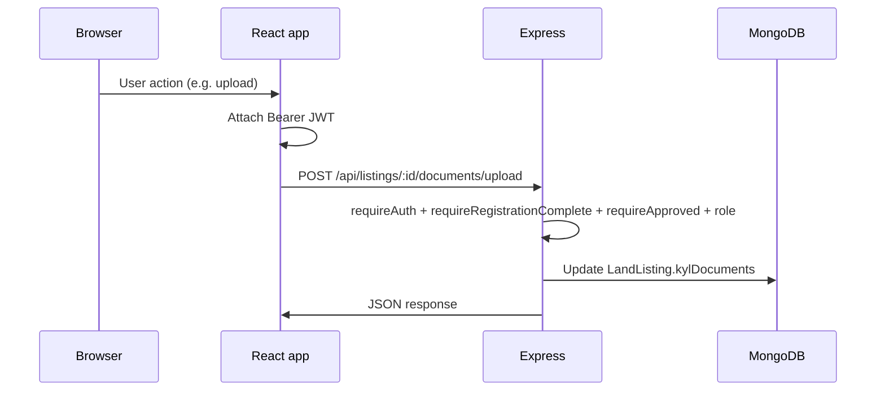
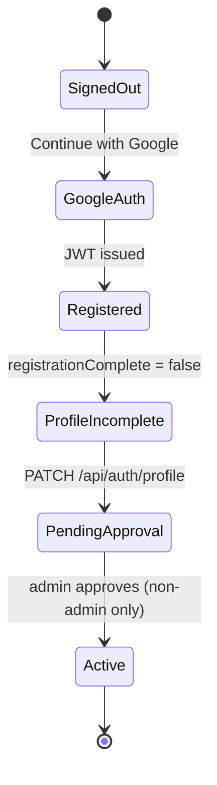
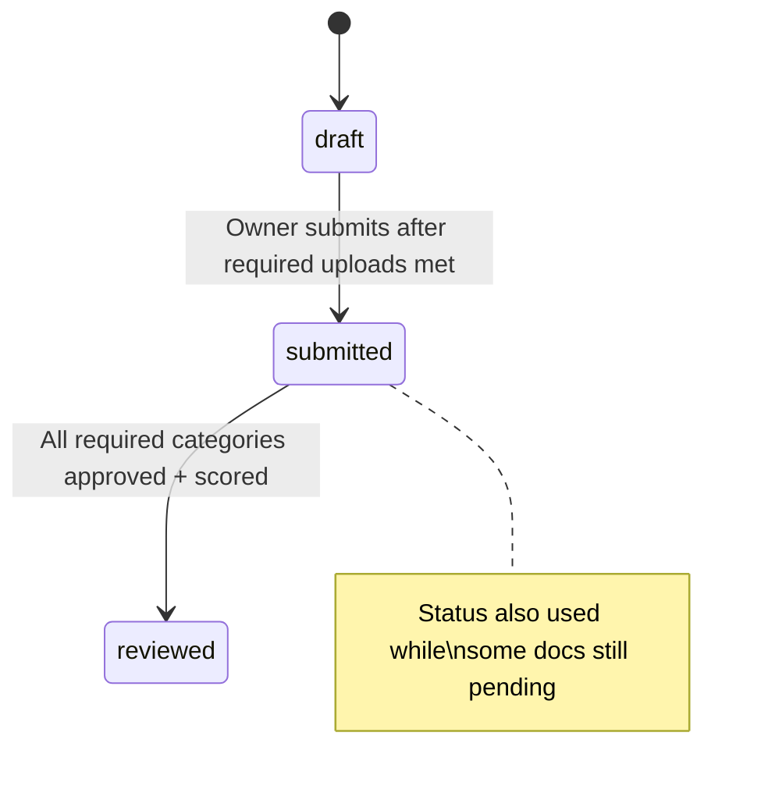

# Bhoomi Sethu

**Bhoomi Sethu** is a full-stack platform for Indian land transactions: landowners publish parcels with **KYL (Know Your Land)** verification, administrators review documents and assign scores, and builders explore published inventory and use a **Deal Room** view for diligence-style parameters and scores.

This document reflects the **current codebase** (backend + frontend layout, routes, and scoring rules).

---

## Table of contents

- [Overview](#overview)
- [Architecture](#architecture)
- [Domain concepts](#domain-concepts)
- [Tech stack](#tech-stack)
- [Repository layout](#repository-layout)
- [Getting started](#getting-started)
- [Environment variables](#environment-variables)
- [Running locally](#running-locally)
- [User roles & application flows](#user-roles--application-flows)
- [Listing lifecycle & KYL scoring](#listing-lifecycle--kyl-scoring)
- [HTTP API reference](#http-api-reference)
- [Data models](#data-models)
- [File uploads](#file-uploads)
- [Security & auth](#security--auth)
- [Frontend routes](#frontend-routes)
- [Health check](#health-check)

---

## Overview

| Capability                | Description                                                                                                                                                                              |
| ------------------------- | ---------------------------------------------------------------------------------------------------------------------------------------------------------------------------------------- |
| **Authentication**        | Google OAuth 2.0; JWT stored client-side (`localStorage`) and sent as `Authorization: Bearer`.                                                                                           |
| **Registration**          | After first sign-in, users complete profile (role, identity/contact fields); **land owners and builders** require **admin approval** before protected actions.                           |
| **KYL profile documents** | Separate from listings: per-landowner submissions in `LandOwnerDocument` (catalog-driven uploads, admin review).                                                                         |
| **Land listings**         | `LandListing` records with **embedded** `kylDocuments` map (`documentKey` → file + admin review + score).                                                                                |
| **Marketplace**           | Public read-only endpoints list **submitted** or **reviewed** listings (no owner PII).                                                                                                   |
| **Deal Room**             | Authenticated UI: hub lists marketplace cards; detail page shows **KYL score**, category breakdown, and diligence-style **parameter** sections (placeholders until extended in the API). |

---

## Architecture

High-level system view:



Request path for a protected listing action:



---

## Domain concepts

### Two different “KYL” surfaces

1. **Land-owner profile KYL** (`/api/land-documents`)
   - Stored in **`LandOwnerDocument`** (one document per catalog key per user).
   - Used for identity/landowner-level verification on the profile side.

2. **Listing KYL (step 2 on a parcel)** (`/api/listings/...`)
   - Stored **inside** **`LandListing.kylDocuments`** as a **Map** keyed by `documentKey` (see `backend/src/models/listing.model.ts` and `backend/src/utils/listingKyl.ts`).
   - Catalog definitions live in **`backend/src/data/documents.ts`** (`LAND_DOCUMENT_CATALOG`).

### Cumulative listing score (KYL score)

Computed in **`computeListingKYLMetrics`** (`backend/src/data/documents.ts`):

- Average of **`adminScore`** over **required** catalog categories only.
- Only documents with **`reviewStatus === 'approved'`** and a numeric score count.
- Result is **rounded to one decimal**; if nothing qualifies, score is **`null`**.

This is **not** a simple average of every uploaded file—it ignores optional categories for the headline number and excludes pending/rejected rows.

---

## Tech stack

| Layer             | Technology                                                                                                            |
| ----------------- | --------------------------------------------------------------------------------------------------------------------- |
| **Frontend**      | React 19, TypeScript, Vite 8, React Router 7, Tailwind CSS 4 (via `@tailwindcss/vite`), global styles in `bhoomi.css` |
| **Auth (client)** | `@react-oauth/google`                                                                                                 |
| **Backend**       | Node.js, Express 5, TypeScript                                                                                        |
| **Database**      | MongoDB with Mongoose 9                                                                                               |
| **Auth (server)** | `google-auth-library` (ID token verify), `jsonwebtoken`                                                               |
| **Uploads**       | Multer 2, disk storage under `backend/uploads/`                                                                       |
| **HTTP**          | `cors`, `helmet`, `morgan`                                                                                            |

---

## Repository layout

```
Bhumisethu/
├── backend/
│   ├── src/
│   │   ├── app.ts                 # Express app: routes, middleware
│   │   ├── server.ts              # HTTP entry
│   │   ├── config/                # env, db, multer (land + listing)
│   │   ├── data/
│   │   │   └── documents.ts       # KYL catalog + computeListingKYLMetrics, required keys
│   │   ├── middleware/
│   │   │   └── auth.ts            # requireAuth, requireRole, requireApproved, requireRegistrationComplete
│   │   ├── models/
│   │   │   ├── user.model.ts
│   │   │   ├── listing.model.ts   # LandListing + embedded kylDocuments map
│   │   │   └── land-owner-document.model.ts
│   │   ├── routes/
│   │   │   ├── auth.routes.ts
│   │   │   ├── dashboard.routes.ts
│   │   │   ├── land-documents.routes.ts
│   │   │   └── listing.routes.ts
│   │   ├── lib/                   # JWT, user DTO helpers
│   │   └── utils/
│   │       └── listingKyl.ts      # Map normalization, effectiveReviewStatus
│   ├── uploads/                   # gitignored runtime uploads
│   └── package.json
│
└── frontend/
    ├── src/
    │   ├── App.tsx                # Routes + registration gate + protected routes
    │   ├── components/            # MainNav, dashboards, listing KYL UI, etc.
    │   ├── context/AuthContext.tsx
    │   ├── lib/                   # authApi, listingsApi, landDocumentsApi, marketplace utils
    │   ├── pages/                 # Home, Dashboard, Listings, Add listing, Deal room, Profile, …
    │   └── styles/bhoomi.css
    └── package.json
```

---

## Getting started

### Prerequisites

- **Node.js** ≥ 18
- **MongoDB** (local or Atlas)
- **Google Cloud** OAuth 2.0 **Web client ID** (same ID used in backend and frontend)

### Environment variables

**Backend** — create `backend/.env`:

```env
PORT=8080
FRONTEND_ORIGIN=http://localhost:5173
MONGO_URI=mongodb://localhost:27017/bhumisethu
GOOGLE_CLIENT_ID=your-google-client-id.apps.googleusercontent.com
JWT_SECRET=use-a-long-random-secret-in-production
```

**Frontend** — create `frontend/.env`:

```env
VITE_API_BASE_URL=http://localhost:8080
VITE_GOOGLE_CLIENT_ID=your-google-client-id.apps.googleusercontent.com
```

Use the **same** Google OAuth client ID in both places.  
`FRONTEND_ORIGIN` must match the Vite dev origin (or your deployed site) for CORS.

---

## Running locally

**Backend** (default port **8080**):

```bash
cd backend
npm install
npm run dev
```

**Frontend** (Vite default **5173**):

```bash
cd frontend
npm install
npm run dev
```

Open `http://localhost:5173`.

**Production build (frontend):**

```bash
cd frontend
npm run build
npm run preview   # optional local preview of dist/
```

---

## User roles & application flows

Roles are defined in `backend/src/types/auth.ts` and stored on **`User`**: `land_owner`, `builder`, `admin`.



| Role           | Typical use in app                                                                                                                                               |
| -------------- | ---------------------------------------------------------------------------------------------------------------------------------------------------------------- |
| **Land owner** | Create listings, upload listing KYL bundle, view scores.                                                                                                         |
| **Builder**    | Browse `/listings`, open Deal Room (requires approval where `ProtectedRoute` enforces it).                                                                       |
| **Admin**      | Approve users; review and score documents (profile + listing). Admins are **`isApproved: true`** by convention; creation is via DB or seed, not a public signup. |

**Approval behavior:** `requireApproved` reloads approval from MongoDB so approval applies without forcing logout (JWT may still carry older claims until refresh).

---

## Listing lifecycle & KYL scoring



- **`draft`**: Parcel metadata created; owner fills `kylDocuments` per catalog.
- **`submitted`**: Owner posted submission; admin review in progress.
- **`reviewed`**: All **required** categories have approved scores (`allRequiredCategoriesScored` in `documents.ts`).

**Submit for review:** `POST /api/listings/:listingId/submit` moves **`draft` → `submitted`** only when **every required** catalog key has an upload; it does not fire automatically on each file upload.

---

## HTTP API reference

Base path: **`/api`**. JSON bodies unless noted.

### Auth — `/api/auth`

| Method  | Path                            | Auth   | Description                                                         |
| ------- | ------------------------------- | ------ | ------------------------------------------------------------------- |
| `POST`  | `/google`                       | No     | Body: `idToken`, optional `role` for new users. Returns JWT + user. |
| `GET`   | `/me`                           | Bearer | Current user profile.                                               |
| `PATCH` | `/profile`                      | Bearer | Complete/update profile; returns new JWT.                           |
| `GET`   | `/admin/pending-users`          | Admin  | Users awaiting approval.                                            |
| `PATCH` | `/admin/approve-user/:googleId` | Admin  | Set `isApproved: true`.                                             |

### Dashboard — `/api/dashboard`

Thin role checks (`requireAuth`, `requireRegistrationComplete`, `requireApproved` where applicable). Example: `GET /api/dashboard/admin` for admin-only smoke response. **Primary UX is in the SPA**, not these sample endpoints.

### Land documents (profile KYL) — `/api/land-documents`

| Method  | Path                               | Description                                                                  |
| ------- | ---------------------------------- | ---------------------------------------------------------------------------- |
| `GET`   | `/catalog`                         | Returns `{ documents: [...] }` — full catalog for profile uploads.           |
| `GET`   | `/my`                              | Land owner: merged catalog rows + `submission` per key + cumulative average. |
| `POST`  | `/upload`                          | Land owner: multipart upload (per catalog key).                              |
| `GET`   | `/file/:submissionId`              | Authenticated download of a stored file.                                     |
| `GET`   | `/admin/pending`                   | Admin: submissions in `pending_review`.                                      |
| `GET`   | `/admin/owner/:googleId`           | Admin: all submissions for one owner + cumulative stats.                     |
| `PATCH` | `/admin/submissions/:submissionId` | Admin: `approved` / `rejected` + score on approve.                           |

Cumulative profile score: **average of approved** submissions with scores (`computeCumulativeAverage` in `land-documents.routes.ts`), distinct from listing KYL math in `documents.ts`.

### Listings — `/api/listings`

| Method  | Path                                         | Description                                                      |
| ------- | -------------------------------------------- | ---------------------------------------------------------------- |
| `POST`  | `/`                                          | Create listing (**land owner**, approved).                       |
| `GET`   | `/mine`                                      | Owner’s listings with cumulative KYL.                            |
| `GET`   | `/public`                                    | **Public**: marketplace list (submitted + reviewed).             |
| `GET`   | `/public/:listingId`                         | **Public**: listing + category scores for detail/Deal Room data. |
| `GET`   | `/:listingId`                                | Owner: single listing metadata.                                  |
| `POST`  | `/:listingId/submit`                         | Owner: submit for review.                                        |
| `GET`   | `/:listingId/documents`                      | Owner: checklist + embedded docs.                                |
| `POST`  | `/:listingId/documents/upload`               | Owner: upload/replace one `documentKey`.                         |
| `GET`   | `/:listingId/documents/file/:documentKey`    | Owner: download file.                                            |
| `GET`   | `/admin/submitted`                           | Admin: submitted listings.                                       |
| `GET`   | `/admin/:listingId/docs`                     | Admin: all documents for listing.                                |
| `GET`   | `/admin/:listingId/docs/file/:documentKey`   | Admin: download.                                                 |
| `PATCH` | `/admin/:listingId/docs/:documentKey/review` | Admin: approve/reject.                                           |
| `PATCH` | `/admin/:listingId/docs/:documentKey/score`  | Admin: score 0–100.                                              |

> **Note:** Listing document identifiers in URLs are **`documentKey`** values from the catalog, not Mongo `_id` strings.

---

## Data models

| Model                 | Purpose                                                                                                                 |
| --------------------- | ----------------------------------------------------------------------------------------------------------------------- |
| **User**              | `googleId`, `role`, `isApproved`, `registrationComplete`, profile fields.                                               |
| **LandListing**       | Parcel fields + `status` + **`kylDocuments`** `Map` of embedded items (file metadata, `adminScore`, `reviewStatus`, …). |
| **LandOwnerDocument** | Profile-level KYL submissions per owner + `documentKey`.                                                                |

---

## File uploads

- **Allowed MIME types:** PDF, JPEG, PNG, WebP, GIF (see `multerListingDocs.ts` / land docs config).
- **Max size:** **15 MB** per file (listing uploader).
- **Storage:** Files written under **`backend/uploads/`** with unique generated names.

---

## Security & auth

- **Helmet** and **CORS** (`FRONTEND_ORIGIN`) on the API.
- **JWT** signed with `JWT_SECRET`; validated on each `requireAuth` route.
- **Role** and **approval** enforced per route chain in `listing.routes.ts` and `land-documents.routes.ts`.

---

## Frontend routes

Defined in `frontend/src/App.tsx`:

| Path                     | Notes                                          |
| ------------------------ | ---------------------------------------------- |
| `/`                      | Home                                           |
| `/complete-registration` | Profile completion                             |
| `/dashboard`             | Dashboard                                      |
| `/profile`               | Profile settings (auth; approval not required) |
| `/listings`              | Marketplace (auth; approval not required)      |
| `/listings/new`          | Add listing (**approved** users)               |
| `/deal-room`             | Deal Room hub (**approved**)                   |
| `/deal-room/:listingId`  | Deal Room detail (**approved**)                |

`RegistrationGate` redirects incomplete profiles to `/complete-registration`. **`ProtectedRoute`** optionally requires **`isApproved`** (non-admin) for gated pages.

---

## Health check

```http
GET /health
```

Returns `{ "status": "ok" }` — useful for load balancers and uptime checks.

---

## License

See [LICENSE](./LICENSE) in the repository root.
